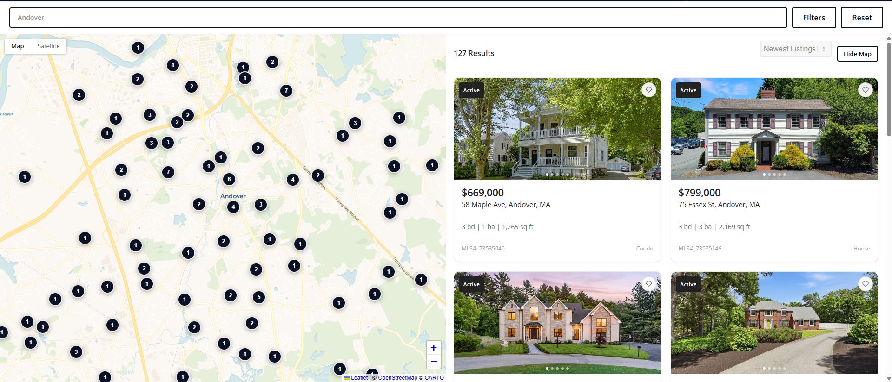
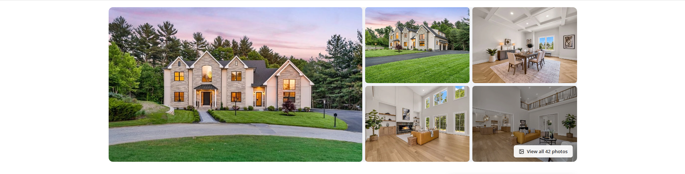
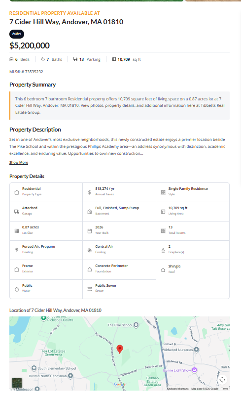

# Repliers API — Minimal PHP Client

A small, dependency-free PHP wrapper for the [Repliers.io](https://docs.repliers.io)
real-estate (MLS) API. No framework — just plain PHP 7.4+ and curl.

This was extracted from a production WordPress site running on the **MLSPIN**
board (Massachusetts), so it includes the property-type translation that MLSPIN
data quietly requires. If you're integrating Repliers with an MLSPIN feed, that
one function will save you a day of debugging (see the gotcha below).

<p align="center">
  
</p>

## About this project

I built a custom MLS search experience for a Massachusetts real-estate brokerage,
replacing a paid third-party IDX widget with a self-hosted integration against the
[Repliers.io](https://repliers.com) API: town-autocomplete search, a live results
grid, an interactive map with clustered markers, and individual listing pages — all
driven by real-time MLS data.

This repo is the reusable heart of that work — the API client — pulled out of the
client-specific code and cleaned up so it stands on its own.

**The problem worth highlighting.** Early on, every search returned zero results
even though the data was clearly there. The cause was a mismatch between how the MLS
*describes* properties and how a normal UI *labels* them: MLSPIN has no "Single
Family" property type at all — it splits houses and condos using a separate `class`
field, files rentals under `Residential Lease`, and so on. Asking the API for the
obvious thing matches nothing and fails silently. I traced it by querying the API's
aggregate endpoints directly to see the real category values, then wrote a
translation layer (`normalizePropertyParams`) that maps human-friendly UI options
onto the schema the API actually expects. That function is the most valuable thing
in this repo.

**What I took away from it:** real-world API data rarely matches your mental model,
and the fix is to inspect what the source actually returns rather than trust the
field names; and that wrapping a messy third-party API behind one small, well-named
class makes the rest of an application dramatically simpler to build and maintain.

## What's here

```
repliers-api-example/
├── src/RepliersClient.php     ← the client (this is the whole library)
├── examples/
│   ├── search-listings.php    ← search and list results
│   ├── get-listing.php        ← fetch one listing by MLS number
│   └── map-clusters.php       ← map "bubble" counts for a region
├── config.example.php         ← copy to config.php and add your key
├── screenshots/               ← images of the live site (for the README)
└── .gitignore                 ← keeps config.php (your key) out of git
```

## Setup

```bash
cp config.example.php config.php      # then paste your real key into config.php
php examples/search-listings.php
```

Get an API key from [repliers.com](https://repliers.com). Authentication is a
single request header: `REPLIERS-API-KEY: <your key>`.

## Quick start

```php
require 'src/RepliersClient.php';

$repliers = new RepliersClient('YOUR_REPLIERS_API_KEY');

$results = $repliers->getListings([
    'city'         => 'Andover',
    'propertyType' => 'Single Family',
    'minPrice'     => 500000,
    'minBedrooms'  => 3,
]);

foreach ($results['listings'] as $listing) {
    echo RepliersClient::formatPrice($listing) . ' — '
       . $listing['address']['city'] . "\n";
}
```

## Screenshots

The live search experience this client powers.

**Map search** — interactive map with clustered markers, filters, and a live results grid:



**Listing detail page:**





## API surface

| Method | What it does |
|---|---|
| `getListings($params, $page, $perPage)` | Search listings with filters |
| `getListing($mlsNumber)` | Fetch one listing by MLS number |
| `getClusters($params, $zoom)` | Map cluster counts for a viewport |
| `normalizePropertyParams($params)` | The MLSPIN translation (used internally) |
| `RepliersClient::formatPrice($listing)` | `"$659,900"` |
| `RepliersClient::photoUrl($listing)` | First photo URL (handles the CDN prefix) |

Common `getListings` filters: `city`, `minPrice`, `maxPrice`, `minBedrooms`,
`minBaths`, `minSqft`, `propertyType`, `type` (`sale` | `lease`), `sortBy`,
`status`, `state`.

## The MLSPIN gotcha (why `normalizePropertyParams` exists)

MLSPIN has **no "Single Family" property type**. Its only `propertyType` values
are `Residential`, `Residential Income`, `Land`, `Commercial Sale`, and
`Business Opportunity`. Houses vs. condos are told apart by a *separate* field
called `class` (`residential` / `condo` / `commercial`). Rentals use
`Residential Lease`.

So a natural-looking request like `propertyType=Single Family` matches **nothing**
and silently returns zero results. `normalizePropertyParams()` maps the
human-friendly names you'd show in a UI onto what the API actually expects:

| You ask for | Sent to the API |
|---|---|
| Single Family | `class=residential` + `propertyType=Residential` |
| Condominium | `class=condo` |
| Multi-Family | `class=residential` + `propertyType=Residential Income` |
| Land | `propertyType=Land` |
| Commercial | `class=commercial` |

(When `type=lease`, the residential types flip to `Residential Lease`.)

## Notes

- `class` and `propertyType` are sent as repeated params (`class[]=a&class[]=b`),
  and the map viewport as a raw JSON `map=` string — `RepliersClient` builds the
  query string accordingly.
- The defaults assume Massachusetts (`state=MA`); change that in
  `getListings()` / `getClusters()` for your market.
- This client has no caching. The original site cached responses for a few
  minutes to avoid hammering the API — add that in your own layer if you make
  high-traffic calls.

